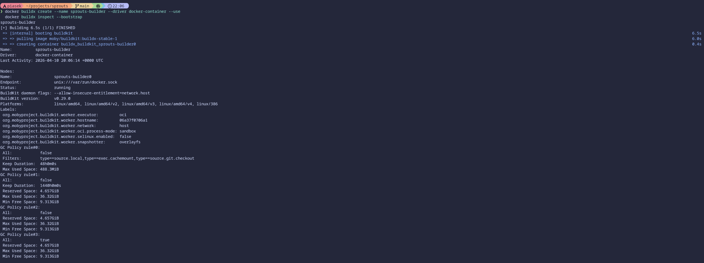
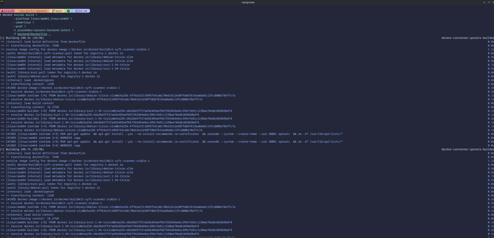
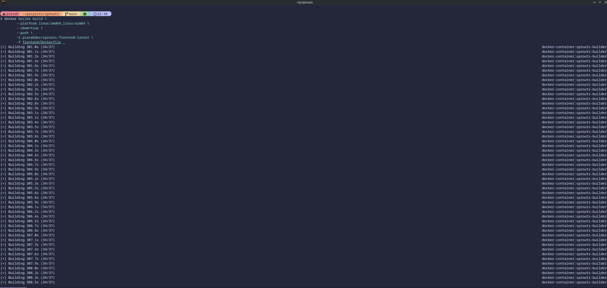
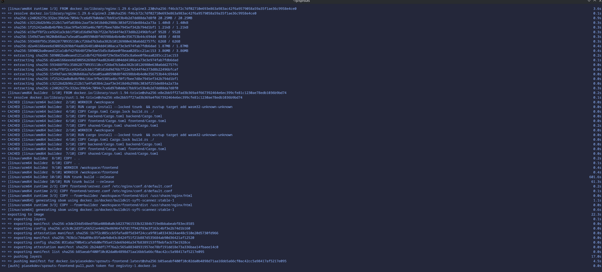
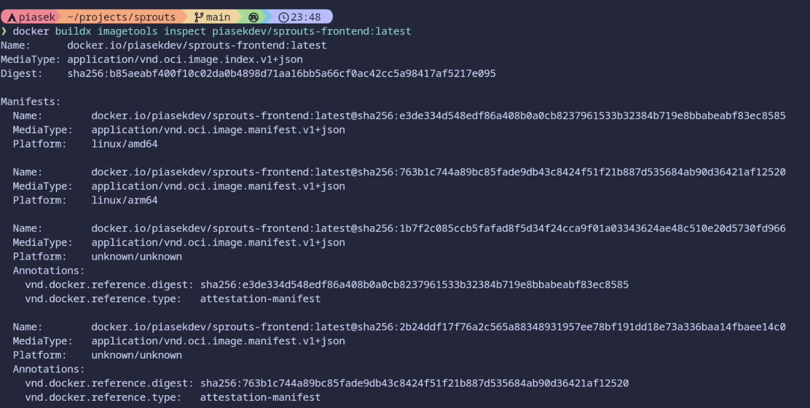
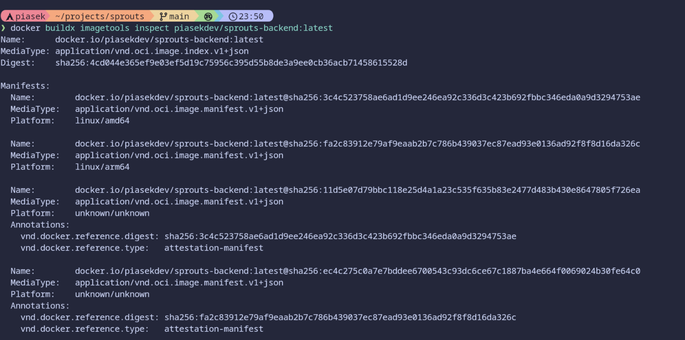

# Punkt 3 - Budowanie obrazów, publikacja i SBOM

W ramach projektu własne obrazy zostały przygotowane dla dwóch usług:

- `frontend`
- `backend`

Usługa `database` pozostaje oparta o oficjalny obraz PostgreSQL i nie wymaga budowania własnego obrazu na potrzeby pierwszej iteracji projektu.

## Builder wieloplatformowy

Do budowania obrazów wykorzystano builder `docker buildx` oparty o sterownik `docker-container`.
Builder został utworzony i uruchomiony poleceniami:

```bash
docker buildx create --name sprouts-builder --driver docker-container --use
docker buildx inspect --bootstrap
```

Potwierdzenie utworzenia buildera:



## Budowanie obrazu backend

```bash
docker buildx build \
  --platform linux/amd64,linux/arm64 \
  --sbom=true \
  --push \
  -t piasekdev/sprouts-backend:latest \
  -f backend/Dockerfile .
```

Repozytorium obrazu:

- <https://hub.docker.com/r/piasekdev/sprouts-backend>

Potwierdzenie build/push obrazu backend:



## Budowanie obrazu frontend

```bash
docker buildx build \
  --platform linux/amd64,linux/arm64 \
  --sbom=true \
  --push \
  -t piasekdev/sprouts-frontend:latest \
  -f frontend/Dockerfile .
```

Repozytorium obrazu:

- <https://hub.docker.com/r/piasekdev/sprouts-frontend>

Potwierdzenie build/push obrazu obrazu frontend:





## Weryfikacja wieloarchitekturowości

Po opublikowaniu obrazów dostępne architektury sprawdzono poleceniami:

```bash
docker buildx imagetools inspect piasekdev/sprouts-backend:latest
docker buildx imagetools inspect piasekdev/sprouts-frontend:latest
```

Wyniki potwierdzają obecność:

- `linux/amd64`
- `linux/arm64`

Potwierdzenie dla frontendu:



Potwierdzenie dla backendu:



## SBOM

Do wygenerowania informacji SBOM użyty został parametr:

```bash
--sbom=true
```

dodany do poleceń `docker buildx build` dla obu obrazów.
