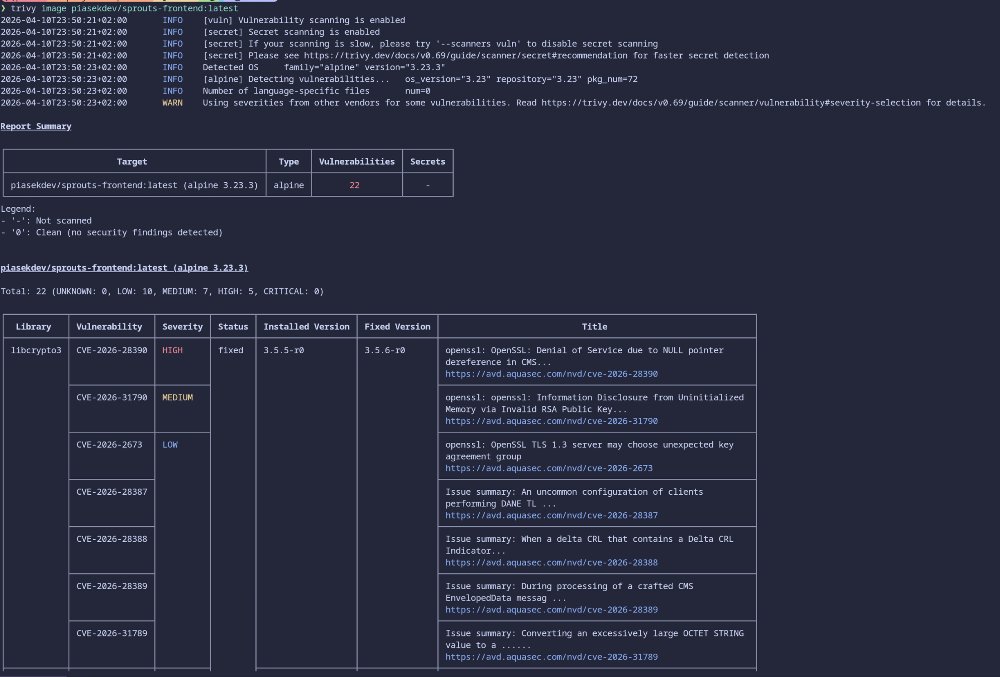
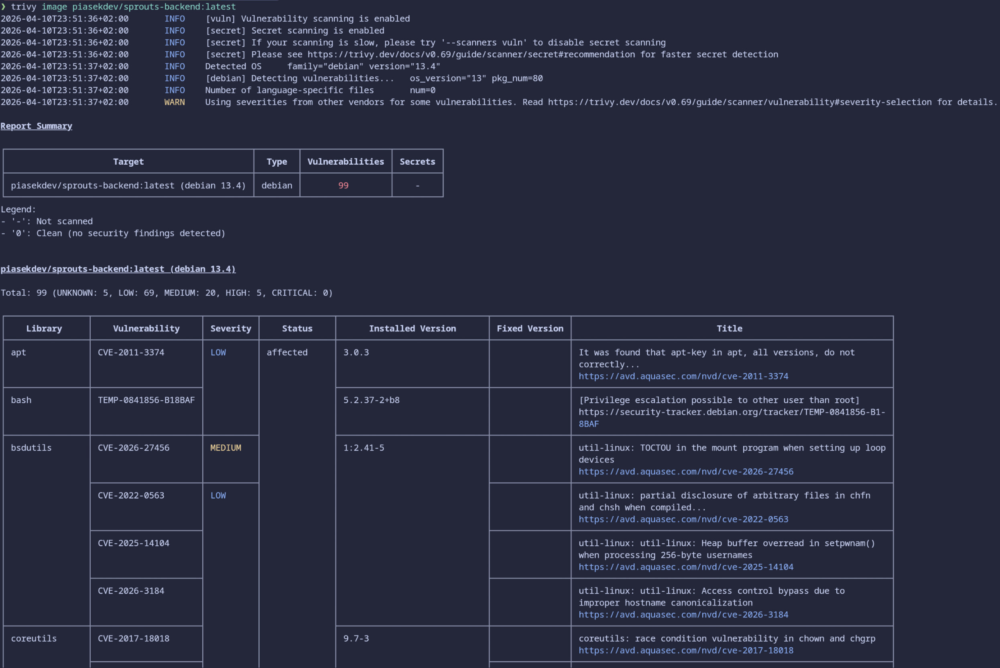

# Punkt 4 - Analiza podatności

Do analizy podatności wykorzystano narzędzie `Trivy`.

## Zakres skanowania

Skanowaniu poddano obrazy:

- `piasekdev/sprouts-backend:latest`
- `piasekdev/sprouts-frontend:latest`

Warstwa bazy danych korzysta z oficjalnego obrazu `postgres:18.3-trixie` i nie była przedmiotem odrębnej analizy w ramach skanowania własnych obrazów aplikacyjnych.

## Użyte polecenia

```bash
trivy image piasekdev/sprouts-backend:latest
trivy image piasekdev/sprouts-frontend:latest
```

## Kryterium zaliczenia

Obrazy nie powinny zawierać podatności o poziomie:

- `critical`
- `high`

## Wyniki

### Frontend

Wynik dla obrazu `piasekdev/sprouts-frontend:latest`:

- `critical`: `0`
- `high`: `5`
- `medium`: `7`
- `low`: `10`

Wykazane podatności dotyczą pakietów systemowych obecnych w warstwie runtime Alpine i nie wynikają bezpośrednio z kodu aplikacji frontendowej.

Potwierdzenie wyniku:



### Backend

Wynik dla obrazu `piasekdev/sprouts-backend:latest`:

- `critical`: `0`
- `high`: `5`
- `medium`: `20`
- `low`: `69`
- `unknown`: `5`

Wykazane podatności o poziomie `high` pochodzą z pakietów systemowych obecnych w warstwie runtime Debiana i nie dotyczą logiki aplikacji. W raporcie Trivy dla tych pozycji nie pojawiają się dostępne wersje naprawcze, dlatego potraktowano je jako podatności odziedziczone po obrazie bazowym, trudne do usunięcia bez zmiany klasy obrazu runtime.

Potwierdzenie wyniku:



## Krótkie uzasadnienie wykrytych podatności high

W obu obrazach nie występują podatności `critical`.
Wykryte podatności `high` są związane z pakietami systemowymi pochodzącymi z oficjalnych obrazów bazowych i nie wynikają z własnego kodu aplikacji.
W przypadku backendu dotyczą one przede wszystkim bibliotek systemowych Debiana bez wskazanej wersji naprawczej w raporcie Trivy, natomiast w przypadku frontendu odnoszą się do pakietów systemowych pochodzących z warstwy Alpine.
