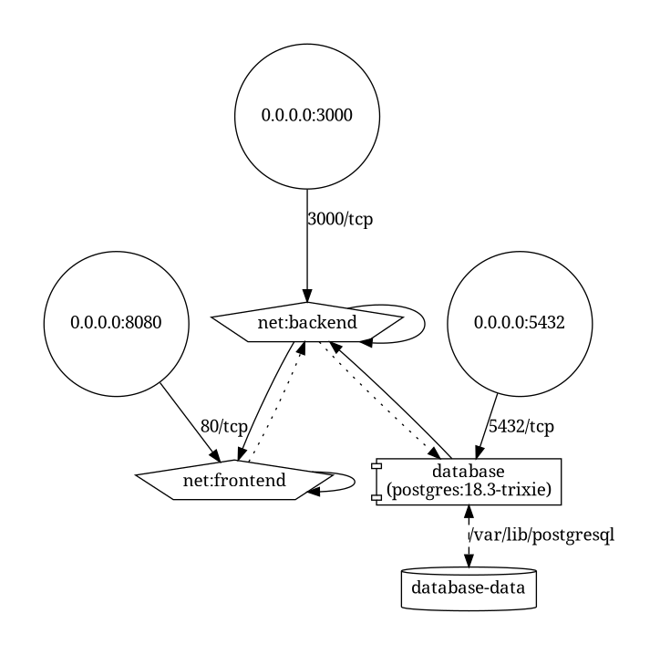

# Punkt 6 - Graficzna reprezentacja docker-compose.yaml

Do przygotowania graficznej reprezentacji końcowej wersji aplikacji opisanej w pliku `docker-compose.yaml` wykorzystano narzędzie `compose-viz`.

## Wykonanie

Diagram został wygenerowany na podstawie rozwiniętej konfiguracji Compose.
Ze względu na użycie zmiennych środowiskowych z pliku `.env` najpierw wygenerowano pośredni plik `compose-viz.input.yaml` poleceniem `docker compose config`, a dopiero następnie wykorzystano go jako wejście do `compose-viz`.
Wygenerowano dwa pliki wynikowe:

- `compose-viz.input.yaml`
- `assets/diagrams/compose-viz.dot`
- `assets/diagrams/compose-viz.png`

Wykorzystane polecenia:

```bash
docker compose -f docker-compose.yaml config > compose-viz.input.yaml
compose-viz compose-viz.input.yaml > assets/diagrams/compose-viz.dot
dot -Tpng assets/diagrams/compose-viz.dot -o assets/diagrams/compose-viz.png
```

## Wynik

Wygenerowany diagram potwierdza końcową strukturę środowiska uruchomieniowego aplikacji.
Na diagramie widoczne są trzy główne usługi:

- `frontend`
- `backend`
- `database`

Diagram pokazuje również:

- dwie jawnie zdefiniowane sieci: `frontend` oraz `backend`,
- podłączenie usługi `frontend` do sieci `frontend`,
- podłączenie usługi `database` do sieci `backend`,
- podłączenie usługi `backend` do obu sieci, dzięki czemu pełni rolę warstwy pośredniczącej między frontendem a bazą danych,
- mapowanie portów hosta `8080`, `3000` i `5432`,
- wykorzystanie nazwanego wolumenu `database-data` do trwałego przechowywania danych PostgreSQL.

Uzyskany wynik jest zgodny z konfiguracją opisaną w pliku `docker-compose.yaml` i stanowi graficzne potwierdzenie końcowej architektury środowiska testowego.


